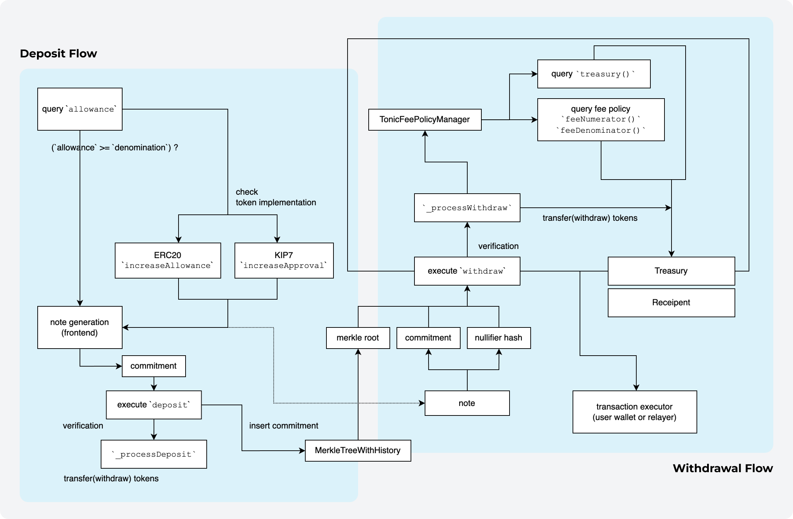

# [](https://tonic.cash) Tonic Core

> Privacy Transactions for Everyone, Powered by zk-SNARK Technology.

This repository contains core smart contracts for [**Tonic**](https://tonic.cash), a decentralized privacy protocol that **implements private token transfers** on an EVM-based blockchain, making it harder to track them. Currently, it supports **Klaytn** and **WEMIX** as the **first-ever crypto mixer.**

## 🌊 Protocol Flow

[](https://docs.tonic.cash/tonic/intro/protocol-flow)

> This is how Tonic works under the hood. (v2023.04)

## 🛡️ Security

### 🔒 Trusted Setup (Tornado Cash)

Zero-knowledge proofs are cryptographic techniques that enable one party to prove knowledge of specific information without revealing the actual data. In the context of Tonic, they are essential for ensuring privacy in transactions.

Tonic takes advantage of [Tornado Cash](https://github.com/tornadocash)'s Trusted Setup, which has received contributions from over 1,100 participants, making it one of the most extensive and secure setups available. The extensive participation in the Trusted Setup ensures the generation of robust and secure parameters, which are vital for creating zero-knowledge proofs.

By leveraging the proven open-source keys from Tornado Cash's Trusted Setup, Tonic enhances its censorship resistance and transparency. This, in turn, significantly improves the platform's overall security and reliability, providing users with a dependable and privacy-preserving solution for transactions.

The keys generated in their Trusted Setup Ceremony can be found here: [Unstoppable Tornado Cash](https://github.com/tornadocash/tornado-core/releases/tag/v2.1)

### 🌪️ Audits (Tornado Cash)

Tonic is a project forked from [Tornado Cash](https://github.com/tornadocash). Tornado Cash received security audits for cryptographic technology, smart contracts, and ZK-SNARK circuits through [ABDK Consulting](https://www.abdk.consulting) in November 2019. You can find their reports under [here](audit/tornado-cash/), under our `audit/tornado-cash` folder.

Given the minor changes made in this fork, which do not affect the fundamental aspects of the original project, it is not necessary to undergo another security audit. Relying on the robust security evaluations conducted for Tornado Cash is reasonable, as the core functionality remains largely unaltered.

### ⚒️ Modifications

In the interest of transparency, we would like to outline the modifications made in the fork:

**1. Implements `IKIP7Receiver` for compatibility with KIP7 (Klaytn's own fungible token standard):**

The `IKIP7Receiver` interface introduces the `onKIP7Received` function, which handles the receipt of KIP-7 tokens. KIP-7 smart contracts call this function on the recipient after a `safeTransfer`. Returning any value other than the magic value(`0x9d188c22`) will result in the transaction being reverted.

```solidity
interface IKIP7Receiver {
    function onKIP7Received(
        address _operator,
        address _from,
        uint256 _amount,
        bytes memory _data
    ) external returns (bytes4);
}
```

Tonic Instances(`ETHTonic` and `ERC20Tonic`), implements the `onKIP7Received` function as follows:

```solidity
function onKIP7Received(
        address _operator,
        address _from,
        uint256 _amount,
        bytes memory _data
    ) external pure returns (bytes4) {
        return 0x9d188c22;
    }
```

**2. Make it possible for the `owner` to withdraw unrelated tokens(airdrops) from the contract:**

The fork incorporates the `Ownable` functionality, allowing the `owner` of the contract to withdraw unrelated tokens, **such as tokens received through airdrops** (this is why we implemented `IKIP7Receiver` for `ETHTonic` as well).

This feature provides more control and flexibility for the contract owner in managing unexpected token transfers to the contract.

```solidity
// ETHTonic (Tonic Instance for Native Tokens)
...

// Only contract-based tokens, just in case for airdrops!
receive() external payable {}

function transfer(address _recipient, address _token, uint256 _amount) external onlyOwner {
    IToken token = IToken(_token);
    token.transfer(_recipient, _amount);
}
```

```solidity
// ERC20Tonic (Tonic instance of ERC20/KIP7)
...

// Only 1) native token and 2) contract-based tokens that is not deposit token, just in case for airdrops!
receive() external payable {}

function transfer(address _recipient, uint256 _amount) external onlyOwner {
    payable(_recipient).transfer(_amount);
}

function transfer(address _recipient, address _tokenAddr, uint256 _amount) external onlyOwner {
    require(_tokenAddr != address(token), "token address should not be the same as deposit token");
    IToken transferableToken = IToken(_tokenAddr);
    transferableToken.transfer(_recipient, _amount);
}
```

**3. Added state variables to keep track of stats, enabling queries in our frontend app:**

The fork introduces two new state variables, `numberOfDeposits` and `numberOfWithdrawals`, to maintain statistics on the number of deposits and withdrawals. This allows users to access these statistics through the frontend app using multicall.

```
// values to keep track of stats
uint256 public numberOfDeposits;
uint256 public numberOfWithdrawals;
```

**4. Implemented TonicFeePolicyManager to manage the policy of withdrawal fees:**

Tonic employs the newly-added `TonicFeePolicyManager` contract to manage withdrawal fee policies. You can view the code [here](./contracts/TonicFeePolicyManager.sol).
Our contracts have the `feePolicyManager` state (which is set by the initial `constructor` and cannot be changed afterward) and include three internal view functions: `_feeNumerator()`, `_feeDenominator()`, and `_treasury()`. These functions return the fee numerator, fee denominator, and treasury address, respectively, querying the `TonicFeePolicyManager` with each call.

In the `_processWithdraw` function within the Tonic instances, the `treasuryFee` is calculated, and the `recipientAmount` is determined by subtracting the `treasuryFee` and `_relayerFee` from the denomination.

```solidity
// Tonic instances
uint256 treasuryFee = (denomination * _feeNumerator()) / _feeDenominator();
uint256 recipientAmount = denomination - treasuryFee - _relayerFee;
```

For `ETHTonic` (Tonic Instance for Native Tokens), the `treasuryFee` is transferred to the treasury address.

```solidity
// ETHTonic (Tonic Instance for Native Tokens)
if (treasuryFee > 0) {
    (bool feeSuccess, ) = _treasury().call{ value: treasuryFee }("");
    require(feeSuccess, "payment to treasury did not go thru");
}
```

For `ERC20Tonic` (Tonic instance of ERC20/KIP7), the `treasuryFee` is safely transferred to the treasury address using the `safeTransfer` function.

```solidity
// ERC20Tonic (Tonic instance of ERC20/KIP7)
if (treasuryFee > 0) {
    token.safeTransfer(_treasury(), treasuryFee);
}
```

## 📃 Deployed Contracts

### 🟠 Klaytn Mainnet (Cypress)

#### Tonic Instances

| Name           | Contract Address                             |
| -------------- | -------------------------------------------- |
| KLAY `100`     | `0x033237b3d6ABCb7d48C5A40Ec3038A53aEc1b77e` |
| KLAY `1000`    | `0x7b853e8387FC6bcFCAa9BDab8d0479E6c9E6782b` |
| KLAY `10000`   | `0x457Caf470fB1031530E8cdD06703da7B1BbCCe04` |
| KLAY `100000`  | `0x9694ea20de96D5E46C8FE1E7975D7a2C7C79Bf2c` |
| oUSDT `100`    | `0x528AE79DAe416bf9623B94fA6Baef0FC3dd12ef8` |
| oUSDT `1000`   | `0xc69C9bBabEDE59562Cd8a6F92Fa50aFf10D8310e` |
| oUSDT `10000`  | `0x503d6D4E14A2A4f78f4c3E51c94F1F53C6bd6D96` |
| oUSDT `100000` | `0x804aA592f7bF0B7EB98db08825D1106eC4822fb3` |
| oETH `0.1`     | `0x70D8D865d556f7D03c463e296ac706CE11B73d4B` |
| oETH `1`       | `0x402f2297f15b6fc9415D6F193ae882a3879b5F09` |
| oETH `10`      | `0xCFa2494dddB338c2fd15224B4Eb9668a5C4de695` |
| oETH `100`     | `0xD10aaD96548CAa7874e435Db0d9676b64554092b` |

#### Periphery

| Name                  | Contract Address                             |
| --------------------- | -------------------------------------------- |
| MulticallV2           | `0x5f5f0d1b9ff8b3dcace308e39b13b203354906e9` |
| TonicFeePolicyManager | `0x5199e8b9d54786EB7d261FE09f51FcA64b61e9fD` |

### 🟣 WEMIX Mainnet

#### Tonic Instances

| Name            | Contract Address                             |
| --------------- | -------------------------------------------- |
| WEMIX `100`     | `0x033237b3d6ABCb7d48C5A40Ec3038A53aEc1b77e` |
| WEMIX `1000`    | `0x7b853e8387FC6bcFCAa9BDab8d0479E6c9E6782b` |
| WEMIX `10000`   | `0x457Caf470fB1031530E8cdD06703da7B1BbCCe04` |
| WEMIX `100000`  | `0x9694ea20de96D5E46C8FE1E7975D7a2C7C79Bf2c` |
| WEMIX$ `100`    | `0x144120Ef18d4223Ab3f4695653a5755C23FBF469` |
| WEMIX$ `1000`   | `0xc978f195C838d3344f74DDBA84235130B3091847` |
| WEMIX$ `10000`  | `0xeD4a38cC990a6E5D817C9d89677c886994803d38` |
| WEMIX$ `100000` | `0xAc04FDbADd7CF8d4BaD0F957d37e3fd0c093A9B6` |
| ETH `0.1`       | `0x2D3bAeBa85D78D202887D34f5618380e90F3c272` |
| ETH `1`         | `0xD2510D275dbca0fe333dAff8Eb51b9105f6aC212` |
| ETH `10`        | `0xE1d1c5094d5eEF16E0207834b2E5FDf634278217` |
| ETH `100`       | `0xfF30E4d7ec19a45710049033d1E51C1a6848E1FA` |

#### Periphery

| Name                  | Contract Address                             |
| --------------------- | -------------------------------------------- |
| MulticallV2           | `0x528AE79DAe416bf9623B94fA6Baef0FC3dd12ef8` |
| TonicFeePolicyManager | `0x5199e8b9d54786EB7d261FE09f51FcA64b61e9fD` |
