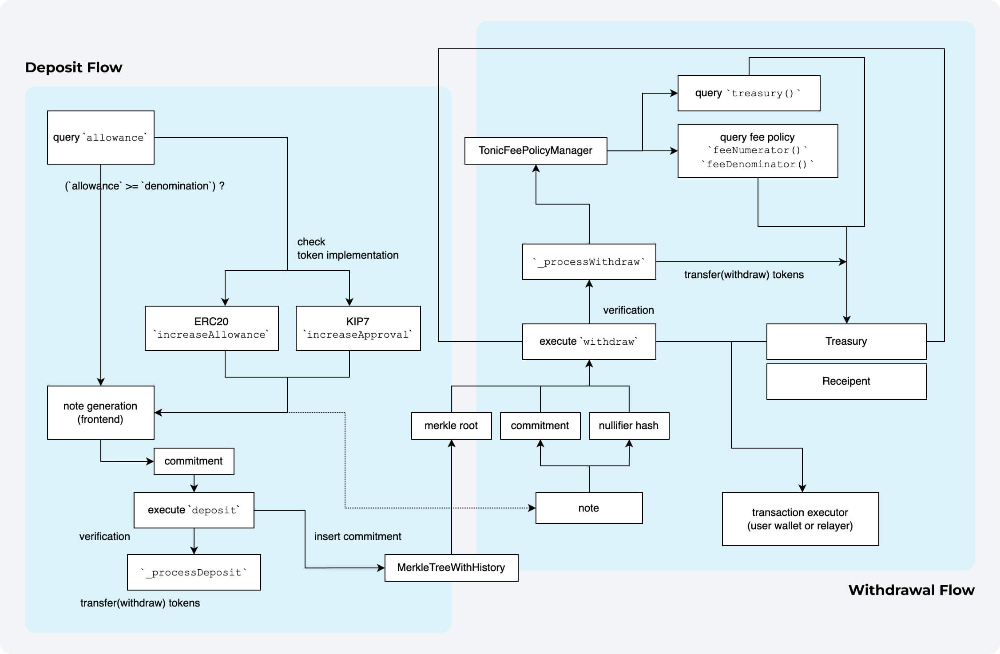

# Tonic Core

## 🌊 Protocol Flow



> This is how Tonic works under the hood. (v2023.04)

## 🛡️ Security

### 🌪️ Audits (Tornado Cash)

Tonic is a project forked from Tornado Cash. Tornado Cash received security audits for cryptographic technology, smart contracts, and ZK-SNARK circuits through [ABDK Consulting](https://www.abdk.consulting) in November 2019. You can find their reports under [here](audit/tornado-cash/).

Given the minor changes made in this fork, which do not affect the fundamental aspects of the original project, it is not necessary to undergo another security audit. Relying on the robust security evaluations conducted for Tornado Cash is reasonable, as the core functionality remains largely unaltered.

### ⚒️ Modifications

In the interest of transparency, we would like to outline the modifications made in the fork:

**1. Implements `IKIP7Receiver` for compatibility with KIP7 (Klaytn's own fungible token standard):**

The `IKIP7Receiver` interface introduces the `onKIP7Received` function, which handles the receipt of KIP-7 tokens. KIP-7 smart contracts call this function on the recipient after a `safeTransfer`. Returning any value other than the magic value(`0x9d188c22`) will result in the transaction being reverted.

```solidity
interface IKIP7Receiver {
    function onKIP7Received(
        address _operator,
        address _from,
        uint256 _amount,
        bytes memory _data
    ) external returns (bytes4);
}
```

Tonic Instances(`ETHTonic` and `ERC20Tonic`), implements the `onKIP7Received` function as follows:

```solidity
function onKIP7Received(
        address _operator,
        address _from,
        uint256 _amount,
        bytes memory _data
    ) external pure returns (bytes4) {
        return 0x9d188c22;
    }
```

**2. Added state variables to keep track of stats, enabling queries in our frontend app:**

The fork introduces two new state variables, `numberOfDeposits` and `numberOfWithdrawals`, to maintain statistics on the number of deposits and withdrawals. This allows users to access these statistics through the frontend app using multicall.

```
// values to keep track of stats
uint256 public numberOfDeposits;
uint256 public numberOfWithdrawals;
```

**3. Implemented TonicFeePolicyManager to manage the policy of withdrawal fees:**

Tonic employs the newly-added `TonicFeePolicyManager` contract to manage withdrawal fee policies. You can view the contract [here](./contracts/TonicFeePolicyManager.sol).
Our contracts have the `feePolicyManager` state (which is set by the initial `constructor` and cannot be changed afterward) and include three internal view functions: `_feeNumerator()`, `_feeDenominator()`, and `_treasury()`. These functions return the fee numerator, fee denominator, and treasury address, respectively, querying the `TonicFeePolicyManager` with each call.

In the `_processWithdraw` function within the Tonic instances, the `treasuryFee` is calculated, and the `recipientAmount` is determined by subtracting the `treasuryFee` and `_relayerFee` from the denomination.

- For `ETHTonic` (Tonic Instance for Native Tokens), the `treasuryFee` is transferred to the treasury address.
- For `ERC20Tonic` (Tonic instance of ERC20/KIP7), the `treasuryFee` is safely transferred to the treasury address using the `safeTransfer` function.

```solidity
// Tonic instances
uint256 treasuryFee = (denomination * _feeNumerator()) / _feeDenominator();
uint256 recipientAmount = denomination - treasuryFee - _relayerFee;

// ETHTonic (Tonic Instance for Native Tokens)
if (treasuryFee > 0) {
    (bool feeSuccess, ) = _treasury().call{ value: treasuryFee }("");
    require(feeSuccess, "payment to treasury did not go thru");
}

// ERC20Tonic (Tonic instance of ERC20/KIP7)
if (treasuryFee > 0) {
    token.safeTransfer(_treasury(), treasuryFee);
}
```
